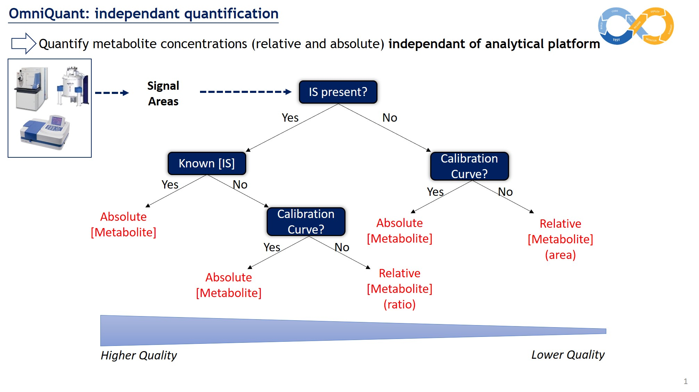
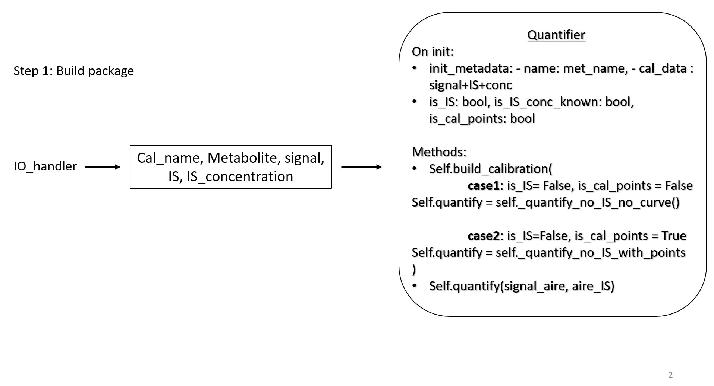

# OmniQuant

## Scientific context and objective

In the context of building an automated computational workflow for 13C-fluxomics, a critical step in extracellular flux calculation and intracellular flux calculation using instationnary approaches is the quantification of metabolite pools. This is done today in a targeted manor using commercial software. These software are heavy-to-use, only apply to one analytical platform at a time, do not permit easy data sharing with existing pipelines and as such are not interoperable with tools present on W4M.

In this context, we present OmniQuant,  a tool to quantify metabolite concentrations & quantities from integration areas generated by different analytical platforms (Mass Spectrometry, UV, NMR, etc.). It should have the following criteria:

* Independent of the analytical platform
* Flexible and interoperable (for W4M integration)
* High-throughput

The tool should be able to handle quantification using internal & external standards, calibration curves, etc. 

## Functional description

The tool is based on the Quantifier, an class that handles calibration and quantification of metabolites. It is based on the following decision tree:

Each metabolite in the calibration data will have it's own Quantifier. As such, interfacing with OmniQuant is as simple as loading in data through the dedicated IO module, generating Quantifiers from the data, and looping over each Quantifier and generate desired outputs. As a package, OmniQuant has as goal to be as lightweight and easy to manipulate as well as powerfull and all-purpose.

## Designing the quantifier class

Here is a temporary diagram that shows the design of the Quantifier class:

## Designing the Graphical User Interface (GUI)

The GUI will leverage the multi-page app function of [streamlit](streamlit.io):
1. Page 1: Input data and parmaeters, check data
2. Calibration page
3. Processing, results vizualization, export results

## Designing the Command Line Interface (CLI)

